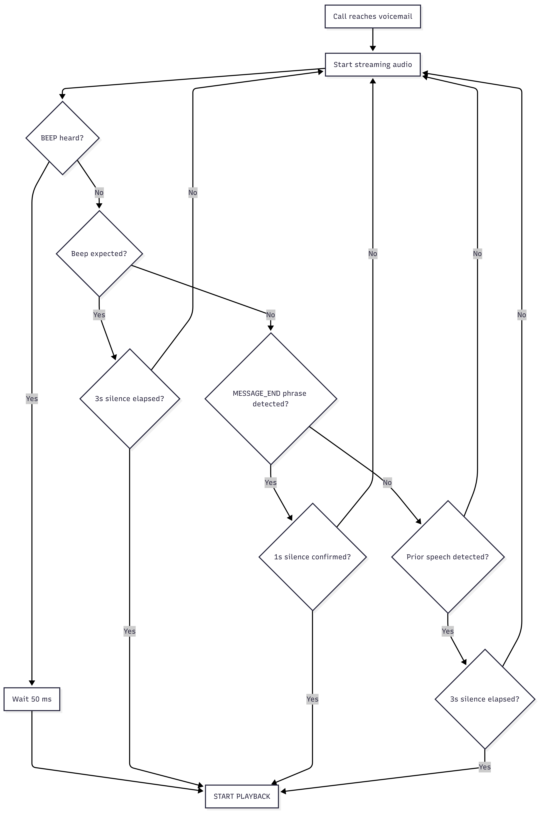

# Voicemail Compliance Drop System

## Overview

This project implements a system to detect the optimal timing for dropping a compliant voicemail message after a customer's voicemail greeting. The system analyzes streaming audio in real-time, detecting key signals to determine when the greeting has ended and it's safe to start playing the pre-recorded message.

## Problem Statement

ClearPath Finance places outbound calls to customers. When calls go to voicemail, the system must leave a compliant message that includes:
- Company name 
- Return phone number 

The challenge is timing the message drop correctly - too early and the consumer might miss the company name, too late and they lose patience.

## Core Logic

The system tracks three primary signals to determine when to drop the voicemail:

### 1. BEEP Signal
- **Detection**: 
   - Identifies voicemail beep tones using narrow-band frequency analysis. 
   - Playback begins approximately 50 ms after beep detection to avoid overlap with beep tail and audio buffering artifacts.
- **Trigger Conditions**:
  - Beep heard directly, OR
  - Beep expected (based on transcript mentioning "beep", "tone", etc.) AND 3 seconds of silence

### 2. MESSAGE_END Signal
- **Detection**: 
   - Uses speech-to-text to identify greeting completion phrases. 
   - MESSAGE_END triggers only after phrase detection and confirmed post-utterance silence, preventing mid-sentence false positives.
- **Keywords**: "hang up", "thanks for calling", "goodbye", "bye", "good day", regex patterns for conversation enders
- **Trigger Conditions**:
  - No beep expected in transcript
  - Greeting end phrase detected
  - 1 second of continuous silence after detection

### 3. TIMEOUT Signal
- **Detection**: Pure silence-based fallback
- **Trigger Conditions**:
  - No beep expected
  - At least one speech burst detected previously
  - 3 seconds of continuous silence

## Core Logic Flow Diagram



## Tools used

- Vosk for free, offline streaming speech-to-text, used to detect greeting content, end-of-greeting phrases, and whether a beep is semantically expected.
- WebRTC VAD for voice activity detection, used to distinguish speech from silence and enforce silence confirmation windows.
- NumPy + SciPy (FFT) for beep detection, using narrow-band frequency analysis, spectral concentration, and stability checks.

## File Structure

```
├── main.py                    # Main processing script (currently processes single file)
├── analyze_audio.py           # Audio analysis and plotting tool
├── audio_stream.py            # Audio streaming utilities
├── logic.txt                  # Core logic summary
├── requirements.txt           # Python dependencies
├── README.md                  # This file
├── models/                    # Vosk speech recognition models
│   └── vosk-model-small-en-us-0.15/
├── plots/                     # Generated analysis plots
│   └── vm*_output/
├── signals/                   # Signal detection modules
│   ├── beep.py               # Beep tone detection
│   ├── message_end.py        # Greeting end detection
│   └── timeout.py            # Silence timeout detection
├── utils/                     # Utility modules
│   ├── classifier.py         # Text classification for beep/greeting detection
│   ├── resolver.py           # Signal priority resolution
│   ├── stt.py                # Speech-to-text using Vosk
│   └── vad.py                # Voice activity detection
└── voicemails/               # Input audio files
    ├── vm1_output.wav
    ├── vm2_output.wav
    ├── vm3_output.wav
    ├── vm4_output.wav
    ├── vm5_output.wav
    ├── vm6_output.wav
    └── vm7_output.wav
```

## Installation

1. **Clone/Download the repository**

2. **Install Python dependencies**:
   ```bash
   pip install -r requirements.txt
   ```

3. **Download Vosk model** (if not included):
   - The small English model is already included in `models/`
   - If needed, download from: https://alphacephei.com/vosk/models

4. **Ensure audio files are in place**:
   - Place the voicemail audio files in the `voicemails/` directory
   - Files should be named: `vm1_output.wav` through `vm7_output.wav`

## Usage

### Running Analysis on Single File

Modify `main.py` to change the filename:

```python
filename = "vm3_output.wav"  
```

Then run:
```bash
python main.py
```

## Output

For each processed voicemail file, the system outputs:

```
Processing file: voicemails/vm3_output.wav
Playback triggered at 4.32s via BEEP
Beep detected at 4.27s
```

Or:

```
Playback triggered at 3.85s via GREETING_END (phrase: 'goodbye')
```

### Output Fields
- **Trigger Time**: Timestamp when voicemail should start playing
- **Reason**: Which signal triggered (BEEP, GREETING_END, TIMEOUT)
- **Beep Time**: If applicable, when beep was detected
- **Detected Phrase**: For GREETING_END, which phrase triggered detection

## Technical Details

### Audio Processing
- **Sample Rate**: 16kHz (resampled if needed)
- **Frame Size**: 20ms chunks
- **Streaming**: Simulates real-time phone call processing

### Beep Detection
- **Frequency Range**: 500-2000 Hz
- **Duration**: Minimum 120ms of stable tone
- **Stability**: Max 30Hz frequency deviation
- **Spectral Ratio**: >35% of total power in dominant frequency

### Speech Detection
- **VAD**: WebRTC VAD for voice activity
- **STT**: Vosk for real-time transcription
- **Silence Threshold**: 1-3 seconds depending on signal

### Signal Processing
- **FFT**: Real-time frequency analysis per frame
- **Windowing**: Hann window to reduce spectral leakage
- **Energy Floor**: Minimum energy threshold to avoid noise